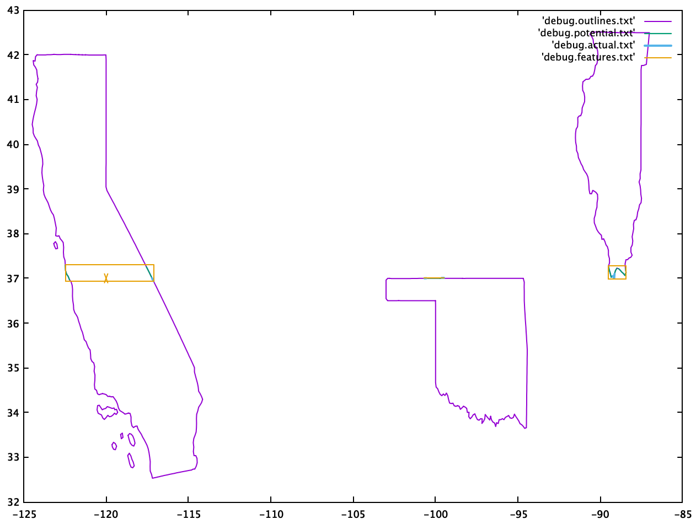

# TIGERLine

Simple utility to filter TIGERLine shape data, and detect collisions of a point with the shapes.

For a description of the TIGERLine format, see [the documentation](https://www.census.gov/programs-surveys/geography/technical-documentation/complete-technical-documentation/tiger-geo-line.html).

## Prerequisites

The ``TigerLine.py`` script requires ``shapefile`` from the ``pyshp`` modules, which can be installed via e.g. ``pip3 install pyshp``.

## Example

This example assumes you have downloaded the 2019 U.S.A. state shapefiles (see the "States (and equivalent)" section [here](https://www.census.gov/cgi-bin/geo/shapefiles/index.php)).

Running the example script ``test_tiger.py`` allows you to determine which state contains a point specified using longitude and latitude:

```
python3 test_tiger.py <prefix path to shapefiles> <longitude> <latitude> [granularity=x] [min_dr=x] [filters="key1:val1,val2..; key2=val1,val2,...; ..."]
```

Here, ``prefix path to shapefiles`` covers the directory path and the file prefix for the TIGERLine data set, and ``longitude`` and ``latitude`` are what one would expect.

The _optional_ parameters ``granularity``, ``min_dr``, and ``filters`` control the size of the grid used to localize points and line segments, the minimum separation between consecutive points in a shape, and what shapes from the file are used in the search:

- ``granularity`` : the size of grid cells
- ``min_dr`` : the minimum separation between consecutive points in a shape; larger values will "simplify" the shape by reducing the number of boundary vertices. The resultant lower resolution shapes are more efficient to process, and the results are more numerically stable.
- ``filters`` : Filter the input shape data according to the fields in section 3.18 of the [TIGERLine documentation](https://www.census.gov/programs-surveys/geography/technical-documentation/complete-technical-documentation/tiger-geo-line.html), with multiple filters separated by a semicolon (``;``). The filter field and keys are therefore defined in the format ``field1:value1,value2,... ; field2:value1,value2,...``.

Worked example:

```
python3 test_tiger.py tl_2019_us_state/tl_2019_us_state -120 37 granularity=0.2 min_dr=1e-1 filters="STUSPS:CA,IL,OK,MI"
```

This example attempts to locate the state enclosing the point at longitude and latitude ``-120,37``. Search is restricted to the states of California, Illinois, Oklahoma, and Michigan. The shapes are simplified by requiring a separation of ``min_dr=1e-1`` (i.e., 0.1 units) between consecutive points defining  shape boundary to increase performance.

Using a mid-2014 MacBook Pro, the output of the example above is:

```
$ time python3 test_tiger.py tl_2019_us_state/tl_2019_us_state -120 37 granularity=0.2 min_dr=1e-1 filters="STUSPS:CA,IL,OK,MI"

fprefix="tl_2019_us_state/tl_2019_us_state" target point=[-120.0, 37.0] data_filters={'STUSPS': ['CA', 'IL', 'OK', 'MI']}

56 shapes total. Fields:
   ('DeletionFlag', 'C', 1, 0)
   ['REGION', 'C', 2, 0]
   ['DIVISION', 'C', 2, 0]
   ['STATEFP', 'C', 2, 0]
   ['STATENS', 'C', 8, 0]
   ['GEOID', 'C', 2, 0]
   ['STUSPS', 'C', 2, 0]
   ['NAME', 'C', 100, 0]
   ['LSAD', 'C', 2, 0]
   ['MTFCC', 'C', 5, 0]
   ['FUNCSTAT', 'C', 1, 0]
   ['ALAND', 'N', 14, 0]
   ['AWATER', 'N', 14, 0]
   ['INTPTLAT', 'C', 11, 0]
   ['INTPTLON', 'C', 12, 0]

Shape 2 (Illinois): simplified 14652 points to 187
Shape 13 (California): simplified 12668 points to 394
Shape 28 (Oklahoma): simplified 21361 points to 230
Shape 42 (Michigan): simplified 10674 points to 227

Point (-120.0,37.0)
  34 potentially intersecting line sections
  3 potentially enclosing shapes
      OUTSIDE shape 2 (Illinois, 2)
    + INSIDE shape 13 (California, 1)
      OUTSIDE shape 28 (Oklahoma, 2)

Point [-120.0, 37.0] intersects with 1 shape(s).
  13 (California) : 1 boundary intersections

real  0m0.389s
user  0m0.302s
sys 0m0.080s
$
```

## Approach

The system is discretized into a grid (cell size specified by the ``granularity`` parameter), and all line sections that span or intersect a grid cell are noted. A horizontal "ray" is then cast from the point of interest, and intersections of that ray with shape line sections are counted; if the final count is zero or even, the target point is outside that shape. If the final count is odd, the point is inside the shape.

## Debug output

If the ``GetShapesEnclosing`` method is called with a debug prefix (as in the ``test_tiger.py`` example script), additional output files are generated; assuming a debug prefix of ``debug``:

- ``debug.outlines.txt`` : the (simplified) shape outlines
- ``debug.potential.txt`` : line sections that potentially intersect with the horizontal ray cast from the point of interest.
- ``debug.actual.txt`` : line sections that actually intersect with the horizontal ray cast from the point of interest.
- ``debug.features.txt`` : feature highlights (e.g. the point of interest, bounding boxes for potential intersections in a shape etc)

These output files may be plotted with ``gnuplot`` as follows:

```
plot 'debug.outlines.txt' with lines linewidth 1, 'debug.potential.txt' with lines linewidth 1.1, 'debug.actual.txt' with lines linewidth 2, 'debug.features.txt' with lines
```

Producing the following output for the example described earlier:


